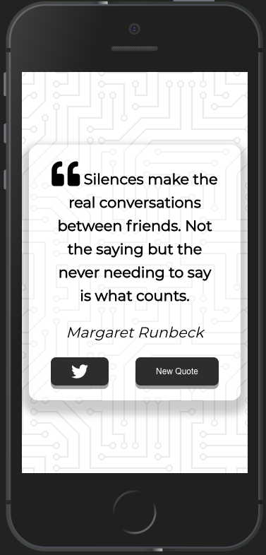

# Quote Generator

Generate a new quote with a click of  a button and also share the quote to Twitter.

# Motivation for this project

The idea came about from the [JavaScript Web Projects: 20 Projects to Build Your Portfolio](https://academy.zerotomastery.io/p/javascript-projects). I encourage you to check it out.

# Final Output

# Getting Started

You need to have basic understanding of HTML, CSS(Flexbox), and Javascript.

# Online Tools

Icons from [Fontawesome](https://fontawesome.com/)

# Deployment

Netlify

Project [view](https://generate-quote.netlify.app/)

+ Clone the repo and contribute if you find this useful and definitely give it a star.
